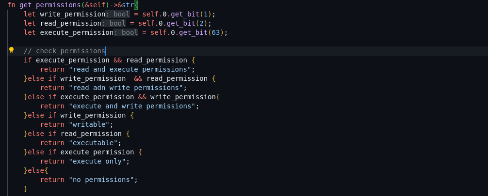

# Features

1. [ ] Memory Allocator - To allocate and manage free memory blocks.
2. [ ] Physical Memory  - Simulate computers physical memory for storing programs data when it is running.
3. [ ] Virtual Address Generator - To create virtual addresses that a program will use to access physical memory.
4. [ ] PageTable and PageTableEntry - Store information about the mappings between virtual address and physcal memory frames.
5. [ ] Create a process - Simulate a program

# **Bugs**

---

1. A page table entry has permissions write and execute set to true but when checking the permissions present on page using _get_permissions()_ it only returns write.
   Cause: Order of conditions in if else block, if else checked the first true condition and returned:

   

   

   

   fix: check combinations conditions before single conditions

   

   
